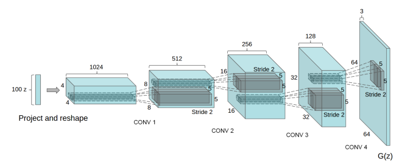
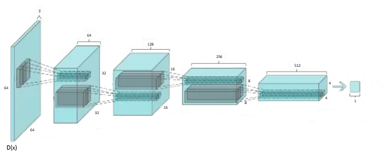
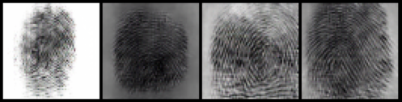
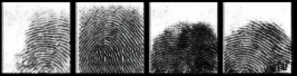
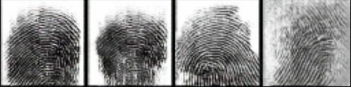

# Synthetic fingerprint generation using machine learning 
Biometric authentication is increasingly being used for its speed and convenience. One of the most commonly used biometrics for this purpose is fingerprint, so this is the subject of the paper.
With the resilient development of artificial intelligence, it is important that biometric systems are properly adapted in terms of security. In the era of models capable of creating so-called, "deepfakes", i.e. fake but realistic-looking multimedia content based on a short voice recording or a single photograph, threats have taken on a new dimension. To prevent abuse in this aspect, new solutions must be introduced.
One of them could be the use of machine learning techniques to train models used in biometric systems. In this way, networks will learn to recognize artificially generated samples from authentic ones. A good tool to carry out this process is a deep convolutional GAN network, which will unsupervisedly learn to generate samples, which can then be used in training the model of the biometric system.

## Project of the network
Project of network belongs to A. Radford, L. Metz and S.Chintala and is described in their publication: _Unsupervised representation learning with deep convolutional generative adversarial networks. arXiv preprint arXiv:1511.06434,(2015)._

<small>Generator structure </small>

<small>Discriminator structure</small>

## Used databases
FCV2002: https://towardsdatascience.com/activation-functions-neural-networks-1cbd9f8d91d6

SoCoFing: https://www.kaggle.com/datasets/ruizgara/socofing

## Comparison of models' performance 
| Database | Generator loss    | Discriminator loss |
|----------|-------------------|--------------------|
| FCV2002  | 4.069452285766602 | 0.0986811518669128 |
| SoCoFing | 4.503159523010254 | 0.1282675862312317 |
| Mixed    | 3.828731775283814 | 0.0940074548125267 |

## Results

<small>Generated fingerprints by model trained on FCV2002 database</small>

<small>Generated fingerprints by model trained on SoCoFing database</small>

<small>Generated fingerprints by model trained on mixed database</small>

